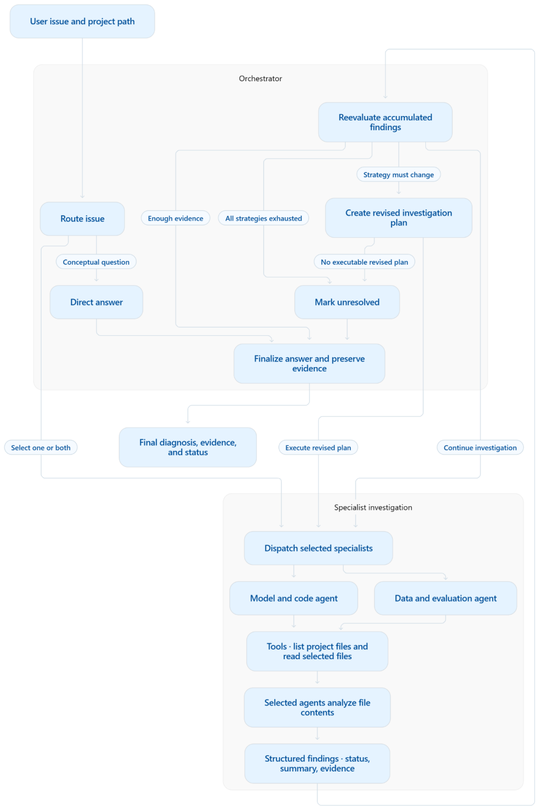

# Adaptive Multi-Agent AI for Machine Learning Pipeline Troubleshooting

An adaptive multi-agent AI system for investigating failures in machine learning codebases. Given a problem description and a local project directory, it selects the relevant specialist LLM agents, inspects project files, and develops a diagnosis from the collected evidence. After each investigation stage, the orchestrator evaluates whether the findings are sufficient to answer the original question, require further investigation, or call for a revised plan guided by a new objective.

The system addresses issues across model implementation, training behavior, data preparation, and evaluation. Its central design is a stateful investigation loop: the next action depends on what the specialist agents discover, with earlier findings retained throughout the workflow.

## Investigation workflow

1. **Route the issue.** The orchestrator chooses a direct answer, a single specialist, or both specialists. Conceptual questions can be answered directly; project-specific failures are routed for file inspection. The routing policy selects the smallest investigation justified by the request.
2. **Select and inspect relevant files.** Each specialist reviews the available filenames, selects files relevant to its domain, and analyzes their contents. Selected files are validated against the project’s file list before their contents are read.
3. **Produce structured findings.** Each specialist agent returns:

   - **Status:** Whether the investigation completed, needs more information, or failed.
   - **Summary:** The specialist’s interpretation of its findings, including possible causes, recommendations, and what remains uncertain.
   - **Evidence:** Concrete observations from the inspected project files on which the specialist bases its conclusions.

4. **Reevaluate the investigation.** The orchestrator reviews the original issue alongside all accumulated findings. It can conclude the investigation, call an additional specialist, or create a revised plan with a focused objective derived from the evidence.
5. **Finalize the diagnosis.** The finalizer combines the findings and preserves the collected evidence. When synthesis is enabled, it combines specialist findings into one answer. A problem identified by one specialist is treated as a possible cause of the reported issue, not a confirmed root cause, unless the evidence collected during the investigation supports that connection.

<p align="center">
  
</p>

## Specialist Agent Responsibilities

| Specialist | Investigation scope |
| --- | --- |
| `model_code` | Model architecture, forward-pass logic, tensor shapes, training loops, loss functions, optimization, initialization, training randomness, inference, and model loading. |
| `data_evaluation` | Datasets, preprocessing, feature transformations, split integrity, leakage, labels, class imbalance, prediction–label alignment, metrics, and evaluation logic. |

Specialists are selected based on the type of issue being investigated, not the file in which it appears. For example, metric computation belongs to `data_evaluation` even when it appears in a training script; model initialization and minibatch ordering belong to `model_code`.

## Architecture and execution

- **Stateful orchestration:** LangGraph manages conditional transitions and shared investigation state, including routing decisions, accumulated specialist results, completed agents, revised plans, and the final answer.
- **Structured interfaces:** Pydantic schemas define file selections, routing and reevaluation decisions, investigation plans, specialist findings, and final outputs.
- **Bounded investigation:** Follow-up and replanned execution filter out specialists that have already run. If additional work is requested but no unused specialist is available, the graph terminates with `needs_more_information` and retains the findings collected so far.
- **Evidence preservation:** Finalization removes identical evidence entries. Optional LLM synthesis updates the conclusion and status while retaining the original evidence list.
- **Local inference:** Ollama serves the LLM specified in `config.py` through `langchain-ollama`. The default model is set to `qwen3:4b`. Routing, specialist analysis, replanning, and synthesis use the extended reasoning setting specified in `config.py`; file selection, reevaluation, and direct answers disable extended reasoning.
- **Read-only project inspection:** File tools read supported text files within the selected project root. The workflow performs diagnosis through file analysis; it does not execute training or modify the inspected project.

The current implementation provides two specialist domains and executes selected specialists sequentially.

## Run an investigation

Use Python 3.10 or later and a running Ollama service with the LLM specified in `config.py` available. From an activated Python environment:

```bash
git clone https://github.com/Neginmoh/adaptive-ai-orchestrator.git
cd adaptive-ai-orchestrator
python -m pip install -r requirements.txt
```

Download the model specified in `config.py` using `ollama pull MODEL_NAME`, replacing `MODEL_NAME` with the configured model name.

Inspect the included demonstration project:

```bash
python main.py --project ./demo_project --issue "Inspect the training code for sources of run-to-run variability and check whether training and validation indices overlap."
```

For another codebase, set `--project` to its directory path and describe the issue to investigate using `--issue`.

The CLI reports investigation progress and stage timings, followed by the final answer, evidence, and status. `resolved` describes the investigation outcome; `needs_more_information` indicates that the available investigation did not establish a sufficient conclusion.

### Final-answer synthesis

| Argument | Behavior |
| --- | --- |
| `--synthesis auto` | Default. Synthesize when multiple specialist results are available. |
| `--synthesis always` | Synthesize specialist findings even when only one specialist ran. |
| `--synthesis never` | Combine specialist summaries and evidence without an additional synthesis call. |

Direct answers bypass specialist synthesis in every mode.

### Configuration

Configure the model name, generation temperature, and extended reasoning setting in `config.py`. Ensure the selected model is available in Ollama.

Supported file formats for inspecting the project are `.py`, `.json`, `.yaml`, `.yml`, `.csv`, `.md`, and `.txt`. Project discovery excludes `.git`, `__pycache__`, `.venv`, `venv`, and `node_modules` directories.

## Tests

The pytest suite includes unit tests for routing interfaces, dispatch, file access, specialist responses, and finalization; integration tests for file-content delivery and adaptive graph transitions; and live-model tests for routing and specialist analysis.

Run the complete suite with Ollama running and the configured model available:

```bash
python -m pytest
```

Run individual test groups:

```bash
python -m pytest -m unit
python -m pytest -m integration
python -m pytest -m live
```

## Code organization

| Path | Responsibility |
| --- | --- |
| `main.py` | Command-line interface and graph invocation. |
| `config.py` | Model and reasoning settings. |
| `orchestrator/graph.py` | Investigation nodes, conditional branches, and termination handling. |
| `orchestrator/router.py` | Initial routing, direct answers, reevaluation, and replanning. |
| `orchestrator/dispatcher.py` | Specialist execution and result collection. |
| `orchestrator/finalizer.py` | Final answer generation, evidence aggregation, and optional synthesis. |
| `orchestrator/state.py`, `orchestrator/schemas.py` | Shared state and orchestration output schemas. |
| `agents/` | Domain specialists and their result schemas. |
| `tools/project_files.py` | Project file listing and reading. |
| `demo_project/` | Example ML demo project for testing the investigation workflow. |
| `tests/` | Unit, integration, and live-model tests. |
